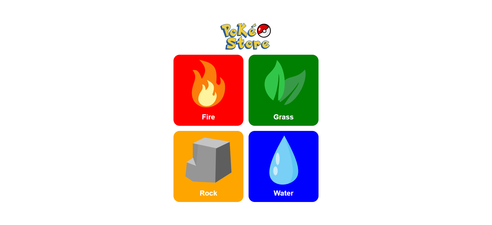
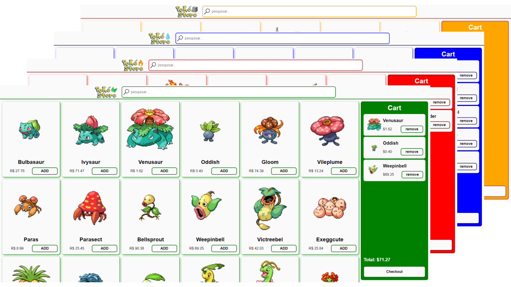
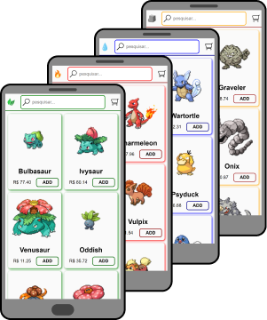
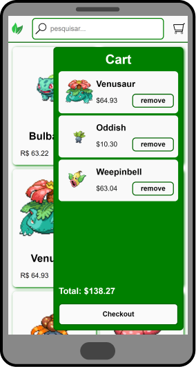

<p align="center">
  
</p>


This project is my rendition of the [B2W Challenge](https://github.com/b2wdigital/desafio-loja-pokemon). Its objective is to create an e-commerce storefront for pokémon.

Live demo: [https://pokestore-guswillemann.vercel.app/](https://pokestore-guswillemann.vercel.app/)

<br />

# Tools

- [Next.js](https://nextjs.org/)
- [React](https://reactjs.org/)
- [Styled Components](https://styled-components.com/)
- [Nookies](https://github.com/maticzav/nookies)

<br />

# The Challenge

Most of the pokémon data used in the project are available on the pokéApi. The missing data (needed for this project) was the pokémon's price, so I randomly generated it after fetching the data from the API.

## The challenge requirements:
- Products list
- User cart
- Cart summary
- Two storefronts for different Pokémon types.

## Extra features:
- Search bar to filter Pokémon
- Checkout button, restarting the purchase data
- Checkout Modal.
- Save the cart data so it will not be lost on a page refresh.

<br />

B2W provides a wireframe for the storefront:

<p align="center">
  
</p>

# Home

Since the challenge objective was to create multiple storefronts, I used the home page to display the available stores.

It has stores for Fire, Grass, Rock, and Water Pokémon:

<p align="center">
  
</p>

# Store pages

The store pages are implementations of the provided wireframe.

## Desktop
<p align="center">
  
</p>

## Mobile
<p align="center">
  
</p>

On mobile, the user cart is a collapsable panel.

<p align="center">
  
</p>

# Development Highlights

## Storefronts:

The storefronts follow the same layout. So I created the `StoreScreen` Component to handle the creation of the pages:

```tsx
export default function StorePage({ products, cartListCookie }) {
  return (
    <StoreScreen
      products={products}
      cartListCookie={cartListCookie}
      storeType={storeType}
      theme={theme}
    />
  );
}
```

Component props:
- theme: an object with the theme values;
- products: an array with the pokémon data;
- cardListCookie: the cookie with the user cart data;
- storeType: the name of the store (based on the pokémon types).

## User Cart

The user cart data is saved in cookies for each path (e.g. '/fire'; '/grass'; etc.), thus having a unique cart for each storefront.